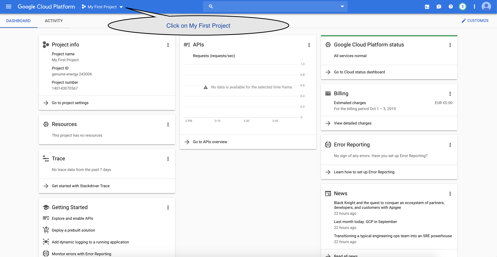
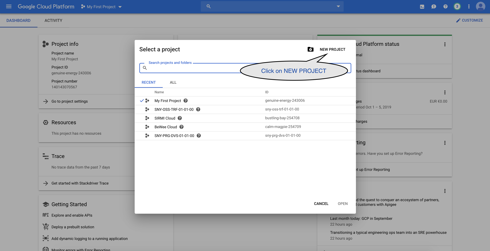
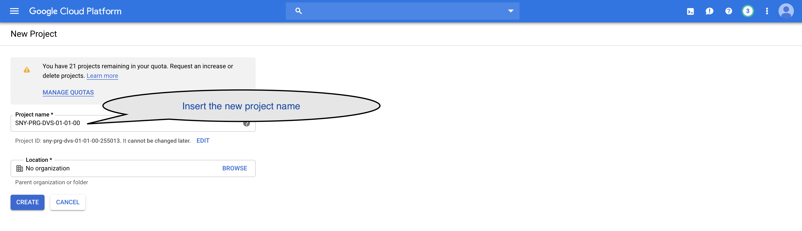
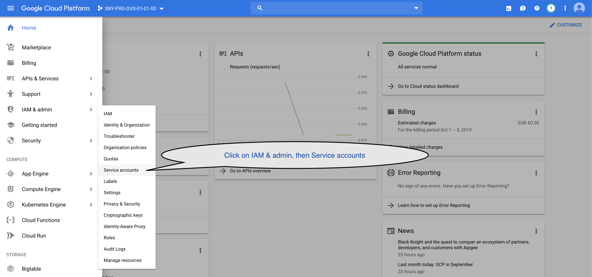
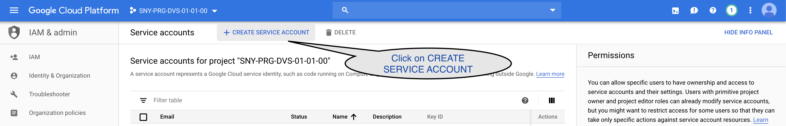
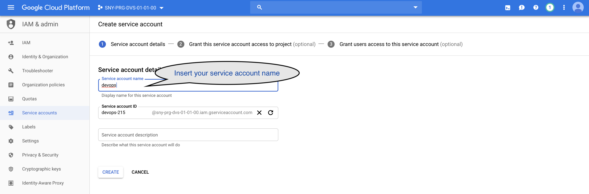
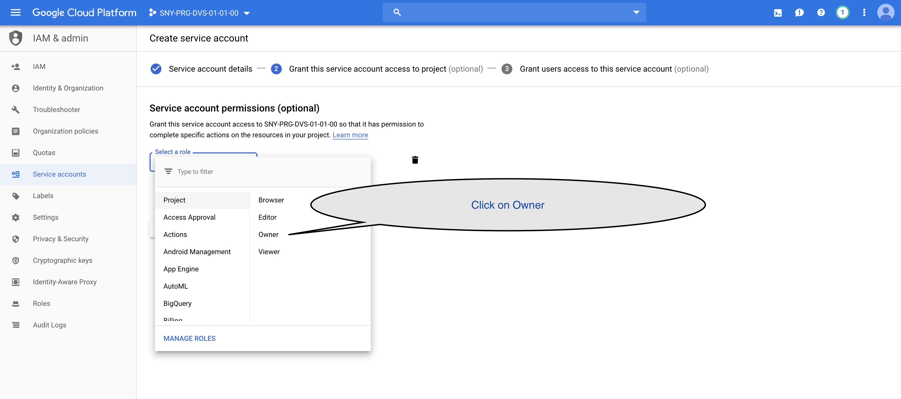
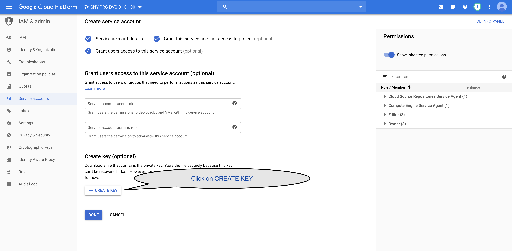

# Configure the Google Cloud Platform

Open the GCP console and click on **My First Project**

On the just openend modal window, click on NEW PROJECT

Insert the new project name, then click on the CREATE button

Being sure to have selected the newly created project, click on **IAM & admin > Service accounts** in the left menu

In the **Service account** page, click on **CREATE SERVICE ACCOUNT**

In the **Create service account** page, insert your service account name (in this case **devops**), then click on **CREATE**

In the next step of the wizard, click on **Owner** to grant the rights to our service account, then click on **CONTINUE**

Before exiting the wizard, create a new Key

Select JSON format then click **CREATE**

A new private key should have been downloaded on your computer.

This key will be used in the next next lab [01 - Provision VM](../01-Provision_VM/README.md)

