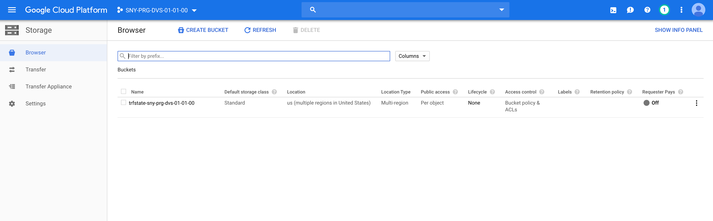

# Provision the Terraform state bucket

## Prerequisites

Having completed labs 00 and 01

## Connect to the Vagrant VM

Connect to the VM using ssh

```console
$ cd <GIT_REPO_NAME>/vagrant
$ vagrant ssh
```

Move to the right path

```console
vagrant@terraform-vm$ cd ~/$GIT_REPO_NAME/labs/02-Provision_Terraform_state_bucket
```

Before proceding, please open the file **terraform.tfvars** and change variables values according to your needs.

## Bucket provisioning

With remote state, Terraform writes the state data to a remote data store, which can then be shared between all members of a team. Terraform supports storing state in Terraform Cloud, HashiCorp Consul, Amazon S3, GCP and more.

In this case we use GCP bucket to share the Terraform state among team members.

Init the Terraform configuration to download 

```console
vagrant@terraform-vm$ terraform init

Initializing the backend...

Initializing provider plugins...
- Checking for available provider plugins...
- Downloading plugin for provider "random" (hashicorp/random) 2.2.1...
- Downloading plugin for provider "google" (hashicorp/google) 2.16.0...

The following providers do not have any version constraints in configuration,
so the latest version was installed.

To prevent automatic upgrades to new major versions that may contain breaking
changes, it is recommended to add version = "..." constraints to the
corresponding provider blocks in configuration, with the constraint strings
suggested below.

* provider.google: version = "~> 2.16"
* provider.random: version = "~> 2.2"

Terraform has been successfully initialized!
```

```console
vagrant@terraform-vm$ terraform plan
Refreshing Terraform state in-memory prior to plan...
The refreshed state will be used to calculate this plan, but will not be
persisted to local or remote state storage.


------------------------------------------------------------------------

An execution plan has been generated and is shown below.
Resource actions are indicated with the following symbols:
  + create

Terraform will perform the following actions:

  # google_storage_bucket.trfstate will be created
  + resource "google_storage_bucket" "trfstate" {
      + bucket_policy_only = (known after apply)
      + force_destroy      = true
      + id                 = (known after apply)
      + location           = "US"
      + name               = (known after apply)
      + project            = (known after apply)
      + self_link          = (known after apply)
      + storage_class      = "STANDARD"
      + url                = (known after apply)
    }

  # random_id.instance_id will be created
  + resource "random_id" "instance_id" {
      + b64         = (known after apply)
      + b64_std     = (known after apply)
      + b64_url     = (known after apply)
      + byte_length = 8
      + dec         = (known after apply)
      + hex         = (known after apply)
      + id          = (known after apply)
    }

Plan: 2 to add, 0 to change, 0 to destroy.

------------------------------------------------------------------------

Note: You didn't specify an "-out" parameter to save this plan, so Terraform
can't guarantee that exactly these actions will be performed if
"terraform apply" is subsequently run.
```

Let's apply the configuration

```console
...
  Enter a value: yes
random_id.instance_id: Creating...
random_id.instance_id: Creation complete after 0s [id=EvEle0gfBfA]
google_storage_bucket.trfstate: Creating...
google_storage_bucket.trfstate: Creation complete after 2s 
[id=trfstate-12f1257b481f05f0]

Apply complete! Resources: 2 added, 0 changed, 0 destroyed.
```

As a result, the bucket is available on GCP console



To sync the local state used so far with the new remote state on the GCS bucket, rename the file **backend.tf_rename_me** to **backend.tf**, open it and change the values accordingly, then run the init again.

Be aware that in **backend.tf** no string interpolation is allowed so you can not use variables.

```console
vagrant@terraform-vm$  terraform init

Initializing the backend...
Acquiring state lock. This may take a few moments...
Do you want to copy existing state to the new backend?
  Pre-existing state was found while migrating the previous "local" backend to the
  newly configured "gcs" backend. No existing state was found in the newly
  configured "gcs" backend. Do you want to copy this state to the new "gcs"
  backend? Enter "yes" to copy and "no" to start with an empty state.

  Enter a value: yes

Successfully configured the backend "gcs"! Terraform will automatically use this backend unless the backend configuration changes.
...
```