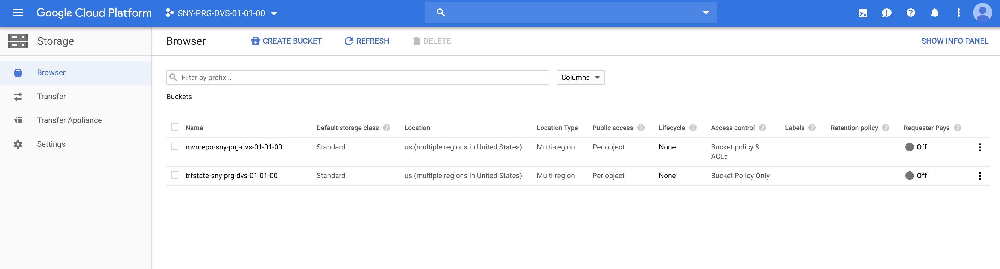

# Provision the Maven repo bucket

## Prerequisites

Having completed labs 00 and 01 and 02

## Connect to the Vagrant VM

Connect to the VM using ssh

```console
$ cd <GIT_REPO_NAME>/vagrant
$ vagrant ssh
```

Move to the right path

```console
vagrant@terraform-vm$ cd ~/$GIT_REPO_NAME/labs/03-Provision_Maven_repo_bucket
```

Before proceding, please open the file **terraform.tfvars** and change variables values according to your needs.

## Bucket provisioning

```console
vagrant@terraform-vm$ terraform init
$ terraform init

Initializing the backend...

Successfully configured the backend "gcs"! Terraform will automatically
use this backend unless the backend configuration changes.

Initializing provider plugins...
- Checking for available provider plugins...
- Downloading plugin for provider "google" (hashicorp/google) 2.16.0...
- Downloading plugin for provider "random" (hashicorp/random) 2.2.1...

The following providers do not have any version constraints in configuration,
so the latest version was installed.

To prevent automatic upgrades to new major versions that may contain breaking
changes, it is recommended to add version = "..." constraints to the
corresponding provider blocks in configuration, with the constraint strings
suggested below.

* provider.google: version = "~> 2.16"
* provider.random: version = "~> 2.2"

Terraform has been successfully initialized!

You may now begin working with Terraform. Try running "terraform plan" to see
any changes that are required for your infrastructure. All Terraform commands
should now work.

If you ever set or change modules or backend configuration for Terraform,
rerun this command to reinitialize your working directory. If you forget, other
commands will detect it and remind you to do so if necessary.
```


```console
vagrant@terraform-vm$ terraform plan
Acquiring state lock. This may take a few moments...
Refreshing Terraform state in-memory prior to plan...
The refreshed state will be used to calculate this plan, but will not be
persisted to local or remote state storage.

google_storage_bucket.trfstate: Refreshing state... [id=trfstate-sny-prg-dvs-01-01-00]

------------------------------------------------------------------------

An execution plan has been generated and is shown below.
Resource actions are indicated with the following symbols:
  + create

Terraform will perform the following actions:

  # google_storage_bucket.mvnrepo will be created
  + resource "google_storage_bucket" "mvnrepo" {
      + bucket_policy_only = (known after apply)
      + force_destroy      = true
      + id                 = (known after apply)
      + location           = "US"
      + name               = "mvnrepo-sny-prg-dvs-01-01-00"
      + project            = (known after apply)
      + self_link          = (known after apply)
      + storage_class      = "STANDARD"
      + url                = (known after apply)
    }

Plan: 1 to add, 0 to change, 0 to destroy.

------------------------------------------------------------------------

Note: You didn't specify an "-out" parameter to save this plan, so Terraform
can't guarantee that exactly these actions will be performed if
"terraform apply" is subsequently run.
```

Then apply the configuration

```console
vagrant@terraform-vm$ terraform apply
Acquiring state lock. This may take a few moments...
google_storage_bucket.trfstate: Refreshing state... [id=trfstate-sny-prg-dvs-01-01-00]

An execution plan has been generated and is shown below.
Resource actions are indicated with the following symbols:
  + create

Terraform will perform the following actions:

  # google_storage_bucket.mvnrepo will be created
  + resource "google_storage_bucket" "mvnrepo" {
      + bucket_policy_only = (known after apply)
      + force_destroy      = true
      + id                 = (known after apply)
      + location           = "US"
      + name               = "mvnrepo-sny-prg-dvs-01-01-00"
      + project            = (known after apply)
      + self_link          = (known after apply)
      + storage_class      = "STANDARD"
      + url                = (known after apply)
    }

Plan: 1 to add, 0 to change, 0 to destroy.

Do you want to perform these actions?
  Terraform will perform the actions described above.
  Only 'yes' will be accepted to approve.

  Enter a value: yes

google_storage_bucket.mvnrepo: Creating...
google_storage_bucket.mvnrepo: Creation complete after 1s [id=mvnrepo-sny-prg-dvs-01-01-00]

Apply complete! Resources: 1 added, 0 changed, 0 destroyed.
```

At the end, a new GCS bucket has been provisioned

