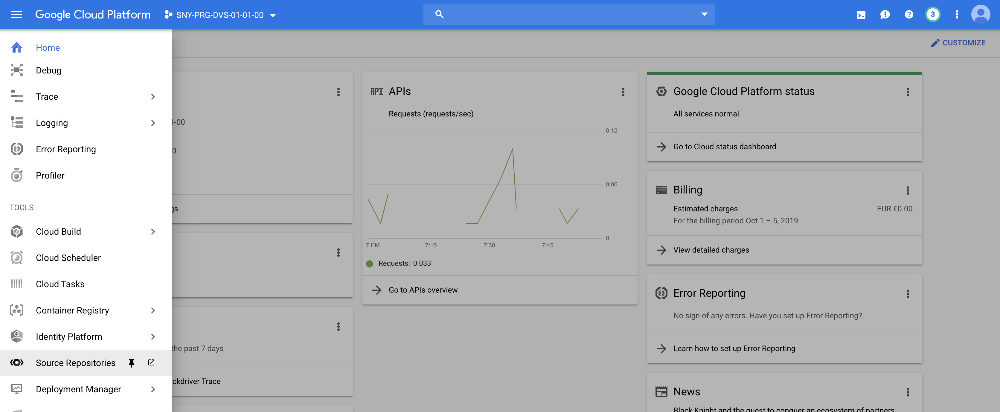
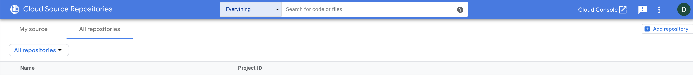
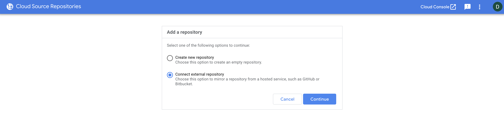

# Map GitHub repos on Google Cloud Source Repositories

## Prerequisites

1. A GitHub account
2. Having forked the following repos on your GitHub account:
   * https://github.com/sunnyvale-academy/Helidon_HelloWorld
   * https://github.com/sunnyvale-academy/World

## Cloud Source Repositories configuration

This lab instructs you on how to mirror a GitHub repository to Cloud Source Repositories. With this configuration, commits that you push to the GitHub repository are copied, or mirrored, into a repository hosted in Cloud Source Repositories.

This lab will be made manually since neither Terraform nor **gcloud** cli utility provide a way to automate the process.

In GCP console click on **Source Repositories** in the left menu.

In the **Source Repositories** page, click on All repositories then **Add repository**

 

Select **Connect external repository** then click **Continue**

 

In the next page, insert your project id and GitHub as the remote repository type

 

If you haven't accessed to GitHub yet, you may encounter some screens that ask you the grant to link your GitHub account with GCP.

If you finished the GitHub authentication process your GitHub is reported below and all the repos you host are listed beneath it.

Select the first repo (World) you forked as a prerequisite (see Prerequisites up above) then click **Connect selected repository**

If everything worked, a pop-up window saying that the repo has been connected should appear. Click Ok to dismiss and step over.

Also, in the repository list on the **Cloud source repositories** page you should see the one you just connected.

**NOTE: you have to repeat the steps above to map also the Helidon_HelloWorld repo you forked as a prerequisite (see Prerequisites up above)** 

