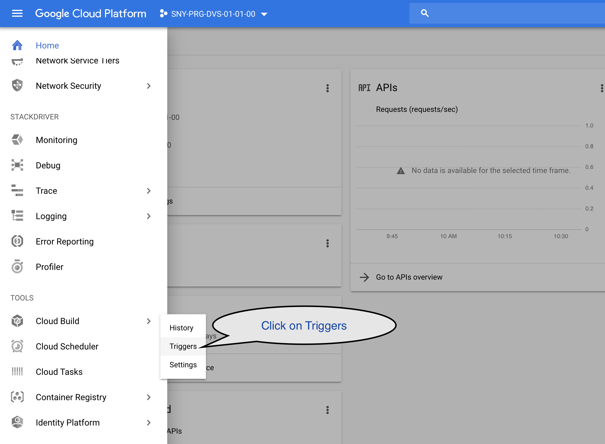
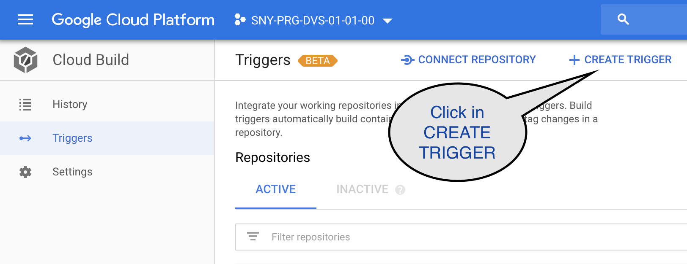
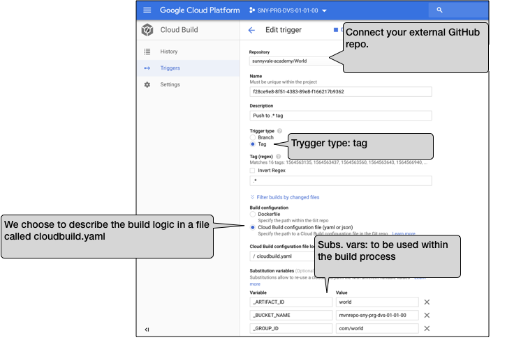
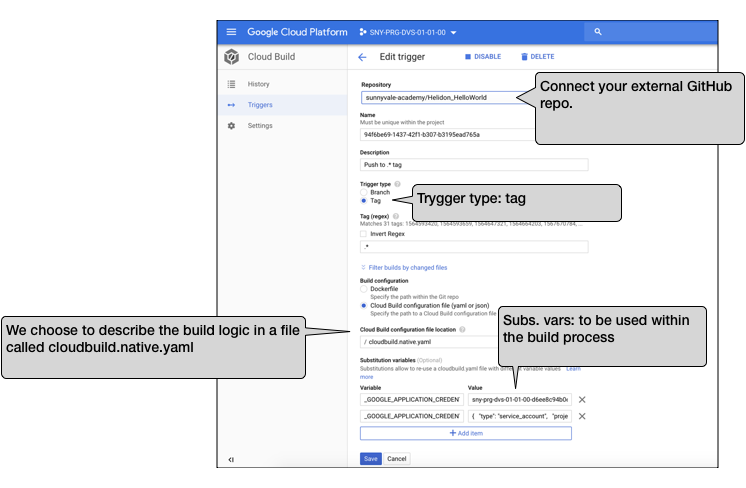

# Create Cloud Build triggers

## Prerequisites

Having completed lab **04 - Map GitHub repos on GCP**

## Configure triggers

The Cloud Build trigger configuration using Terraform is not fully supported by the Google Terraform provider so all the .tf files in this directory are meant for experimental purpose only.

To complete the lab we will create the Cloud Build triggers (hooking the World and Helidon_HelloWorld repos) using the GCP web console.

In the next page, click on **Triggers -> CREATE TRIGGER** button.

Create the World trigger with the following configurations.

**Repository:** choose the **your-github-account/Work** repo  (you should have mapped this repo in the lab 4).

**Trigger type:** Tag

**Build configuration:** Cloud Build configuration file

**Cloud Build configuration file location:** cloudbuild.yaml (this file is contained in the World repo among the source code)

In the **Substitution variables** section, add the following:

- **_ARTIFACT_ID:** This is the Maven artifact id that will be used for this artifcat. Insert `world`.

- **_BUCKET_NAME:** The name of the bucket we will be using to store Maven artifacts. Fill with your bucket name.

- **_GROUP_ID:** The name of the group id we will be using to store the Maven artifact. Insert `com/work`

Please refer to the following image for details:

The same as you created the World trigger, repeat the procedure described to far to create the **Helidon_HelloWorld** trigger.

Use the following details.

**Repository:** choose the **your-github-account/Helidon_HelloWork** repo  (you should have mapped this repo in the lab 4).

**Trigger type:** Tag

**Build configuration:** Cloud Build configuration file

**Cloud Build configuration file location:** Use the cloudbuild.yaml to compile the application with OpenJDK or cloudbuild.native.yaml to create a native-image using GraalVM.

In the **Substitution variables** section, add the following:

- **GOOGLE_APPLICATION_CREDENTIALS:** The name of the JSON file containing your GCP credentials. 

- **_GOOGLE_APPLICATION_CREDENTIALS_CONTENT:** The content of your JSON file containing your GCP credentials. This value will be injected in a file within the build steps to be used then authenticating to the Maven repo in order to download the World artifact. 

Please refer to the following image for details:

