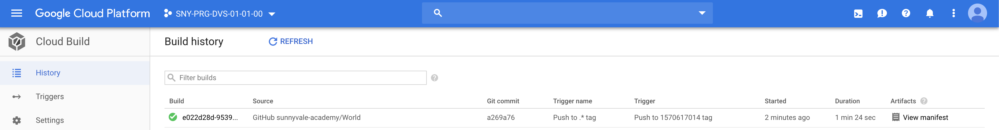
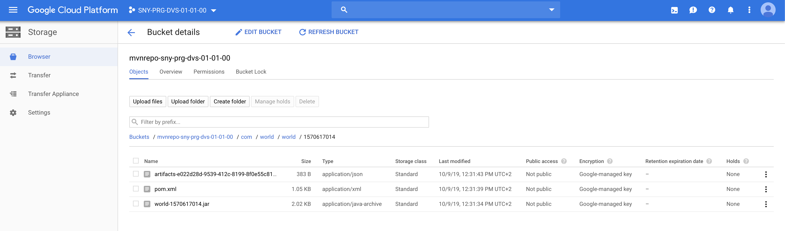
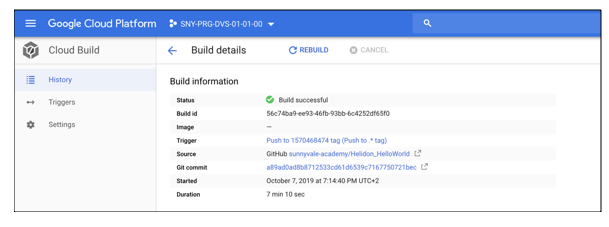
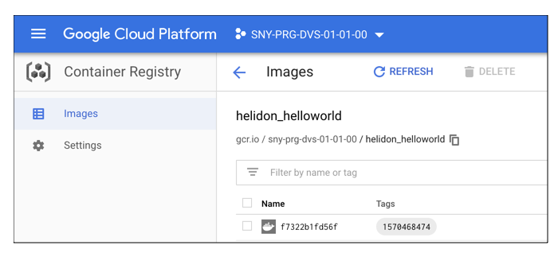

# Trigger builds

## Prerequisites

Having completed labs 03, 04 and 05.

## Connect to the Vagrant VM

Connect to the VM using ssh

```console
$ cd <GIT_REPO_NAME>/vagrant
$ vagrant ssh
```

## Tag your World repo to start a build


Move to the right path

```console
vagrant@terraform-vm$ cd ~/World
```

Tag your World repo to start a build

```console
vagrant@terraform-vm$ git tag "1570468336" && git push origin --tags
Total 0 (delta 0), reused 0 (delta 0)
To https://github.com/sunnyvale-academy/World.git
 * [new tag]         1570468336 -> 1570468336
```

You should see a build triggered on Google Cloud Build web console.



If everything went fine, the build ends in successful state.

If you take a look of your Maven repo bucket, the same version (tag) of your world library should appear.

 

## Build your Helidon_HelloWorld repo

Move to the right path

```console
vagrant@terraform-vm$ cd ~/Helidon_HelloWorld
```

The World version (tag name), must be referenced in `Helidon_HelloWorld/pom.xml` in order to compile the project.

```xml
...
        <dependency>
            <groupId>com.world</groupId>
            <artifactId>world</artifactId>
            <version>1570468336</version>
        </dependency>
...
```

Tag your World repo to start a build

```console
vagrant@terraform-vm$ git tag "1570468474" && git push origin --tags
Total 0 (delta 0), reused 0 (delta 0)
To https://github.com/sunnyvale-academy/Helidon_HelloWorld.git
 * [new tag]         1570468474 -> 1570468474
```

You should see a build triggered on Google Cloud Build web console.

If everything went fine, the build ends in successful state.




If you take a look in the Google Container Registry, you should find a Docker image with the same tag.

 